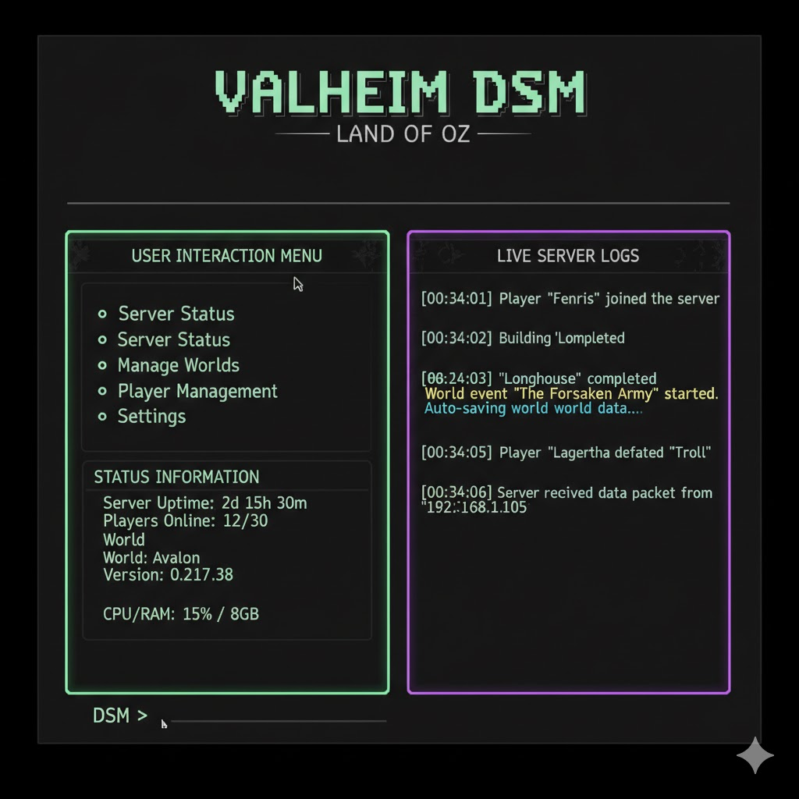

# Land of OZ - Dedicated Server Manager - Valheim

[](https://github.com/caleb-collar/land-of-oz-dsm-valheim/actions/workflows/ci.yml)
[](https://codecov.io/gh/caleb-collar/land-of-oz-dsm-valheim)

## About

- This software is a dedicated server manager (DSM) for Valheim.
- The Valheim DSM is part of the Land of Oz series of software.
- This software is to provide an easy to use container and virtualization free
  dedicate server hosting experience.

## Details

- The software is written in TypeScript using Node.js as the runtime
- The DSM program is a rich featured management tool with a Yoga powered TUI.
  - The TUI uses Ink which is a React flavored TUI framework
  - The motion in the TUI is accelerated by the ASCII Motion app.
    - Any AI agent working in this repo has access to the ASCII Motion MCP
      server tooling for generating beautiful and efficient animated ascii based
      art.

## Features

### Key features are as follows, all features have configuration available in the TUI:

- Windows, Mac, and Linux, task generation.
  - You may use the CLI with flags or CLI TUI to generate a task that auto runs
    with various options to keep the dedicated server running.
- Rich TUI based server setting configuration.
  - All of Valheim's dedicated server settings are accessible in properly
    ordered and organized in modern menus and sub menus.
- Automatic dependency installation if you opt in (will auto check and install
  steamcmd etc when run if you opt for this)
- Uses steamcmd to install and auto update Valheim when there are updates.
- Allows runtime server/admin commands to be run from the TUI.
- Watchdog to ensure that if the server crashes, it is auto restarted.
- Import existing save files (.db, .fwl pairs) and run them.
- Persistent configuration (settings, active world, etc persist between server
  and system restarts)

## TUI

This TUI (Text User Interface) for Valheim DSM: Land of Oz is designed for
high-efficiency server administration with a modern, animated "cyber-viking"
aesthetic. It prioritizes real-time observability while keeping management tools
front and center. Below is a generalized mockup of the DSM TUI built using React
via Ink. Motion is created using ASCII Motion.

> The Valheim DSM: Land of Oz interface utilizes a structured three-zone TUI
> architecture designed for maximum administrative visibility. A bold animated
> ASCII header anchors the top of the screen, followed by a responsive layout
> that separates active management from passive monitoring. Where possible, the
> system uses Ink to display data (realtime active react components). There is a
> real-time log feed with color-coded event markers. 

---

## Architecture

### Technology Stack

| Layer            | Technology       | Purpose                                          |
| ---------------- | ---------------- | ------------------------------------------------ |
| Runtime          | Node.js 22.x     | TypeScript-first with tsx execution              |
| TUI Framework    | Ink 5.x          | React-based terminal UI with Yoga flexbox layout |
| State Management | Zustand          | Lightweight, React-compatible global state       |
| Animation        | ASCII Motion MCP | Animated ASCII art for headers and transitions   |
| Process Control  | child_process    | Cross-platform subprocess management             |
| Configuration    | conf             | Persistent settings with JSON storage            |

### Directory Structure

```
land-of-oz-dsm-valheim/
├── package.json              # Node.js dependencies and scripts
├── tsconfig.json             # TypeScript configuration
├── vitest.config.ts          # Test configuration
├── biome.json                # Linting and formatting
├── main.ts                   # CLI entry point and argument parser
├── README.md                 # Project documentation (this file)
├── AGENTS.md                 # AI agent implementation guidance
├── .agent-docs/              # Detailed implementation references for agents
│   ├── 00-overview.md
│   ├── 01-tui-architecture.md
│   ├── 02-process-management.md
│   ├── 03-steamcmd-integration.md
│   ├── 04-configuration.md
│   └── 05-valheim-settings.md
│
├── src/
│   ├── mod.ts                # Public API exports
│   │
│   ├── cli/
│   │   ├── mod.ts            # CLI module exports
│   │   ├── args.ts           # Argument parsing (Cliffy or custom)
│   │   └── commands/         # Subcommand handlers
│   │       ├── start.ts
│   │       ├── stop.ts
│   │       ├── install.ts
│   │       └── config.ts
│   │
│   ├── tui/
│   │   ├── mod.ts            # TUI module exports
│   │   ├── App.tsx           # Root Ink component
│   │   ├── store.ts          # Zustand state store
│   │   ├── hooks/            # Custom React hooks
│   │   │   ├── useServer.ts
│   │   │   ├── useLogs.ts
│   │   │   └── useConfig.ts
│   │   ├── components/       # Reusable UI components
│   │   │   ├── Header.tsx          # Animated ASCII header
│   │   │   ├── StatusBar.tsx       # Server status indicators
│   │   │   ├── LogFeed.tsx         # Real-time color-coded logs
│   │   │   ├── Menu.tsx            # Navigation menu
│   │   │   ├── SettingsPanel.tsx   # Server settings editor
│   │   │   └── Modal.tsx           # Overlay dialogs
│   │   └── screens/          # Full-screen views
│   │       ├── Dashboard.tsx
│   │       ├── Settings.tsx
│   │       ├── Worlds.tsx
│   │       └── Console.tsx
│   │
│   ├── server/
│   │   ├── mod.ts            # Server management exports
│   │   ├── process.ts        # Valheim process wrapper
│   │   ├── watchdog.ts       # Crash detection and auto-restart
│   │   ├── logs.ts           # Log parsing and streaming
│   │   └── commands.ts       # Runtime admin command execution
│   │
│   ├── steamcmd/
│   │   ├── mod.ts            # SteamCMD module exports
│   │   ├── installer.ts      # Auto-install SteamCMD
│   │   ├── updater.ts        # Valheim installation/updates
│   │   └── paths.ts          # Platform-specific path resolution
│   │
│   ├── config/
│   │   ├── mod.ts            # Configuration module exports
│   │   ├── schema.ts         # Zod schemas for validation
│   │   ├── store.ts          # Deno KV persistence layer
│   │   └── defaults.ts       # Default configuration values
│   │
│   ├── valheim/
│   │   ├── mod.ts            # Valheim-specific exports
│   │   ├── settings.ts       # Server settings types and handlers
│   │   ├── worlds.ts         # World file management (.db, .fwl)
│   │   └── args.ts           # Valheim CLI argument builder
│   │
│   └── utils/
│       ├── mod.ts            # Utility exports
│       ├── platform.ts       # OS detection and paths
│       ├── logger.ts         # Structured logging
│       └── events.ts         # Event emitter for internal messaging
│
└── assets/
    └── ascii/                # ASCII art assets (exported from ASCII Motion)
        ├── header.json
        └── spinner.json
```

### Core Modules

#### 1. CLI (`src/cli/`)

The command-line interface provides direct access to all DSM functionality:

- `oz-valheim start` - Start the server (with optional `--tui` flag)
- `oz-valheim stop` - Gracefully stop the server
- `oz-valheim install` - Install/update Valheim via SteamCMD
- `oz-valheim config` - View/edit configuration
- `oz-valheim tui` - Launch the full TUI experience

#### 2. TUI (`src/tui/`)

The terminal user interface is built with Ink (React for terminals):

- **Three-Zone Layout**: Header, Main Content, Log Feed
- **Zustand Store**: Centralized state for server status, settings, logs
- **Component Library**: Reusable, themed components with cyan/orange/green
  palette
- **Keyboard Navigation**: Full keyboard control with vim-style bindings

#### 3. Server Process Management (`src/server/`)

Manages the Valheim dedicated server lifecycle:

- **Process Wrapper**: Spawn, monitor, and terminate the server process
- **Watchdog**: Detect crashes via exit codes and auto-restart with backoff
- **Log Streaming**: Parse stdout/stderr, categorize events, emit to TUI
- **Command Injection**: Send admin commands to the running server

#### 4. SteamCMD Integration (`src/steamcmd/`)

Handles all Steam-related operations:

- **Auto-Install**: Download and configure SteamCMD per platform
- **Update Detection**: Check for Valheim updates before launching
- **Anonymous Login**: Valheim dedicated server doesn't require authentication

#### 5. Configuration (`src/config/`)

Persistent settings management:

- **Deno KV**: Local key-value storage for settings
- **Zod Validation**: Type-safe schema enforcement
- **Migration Support**: Handle config version upgrades

#### 6. Valheim Integration (`src/valheim/`)

Game-specific functionality:

- **Settings Types**: Typed definitions for all server arguments
- **World Management**: Import, export, and switch between worlds
- **Argument Builder**: Construct valid Valheim CLI arguments

### State Flow

```
┌─────────────────────────────────────────────────────────────────┐
│                         Zustand Store                           │
│  ┌──────────┐  ┌──────────┐  ┌──────────┐  ┌──────────────────┐ │
│  │ server   │  │ config   │  │ logs     │  │ ui               │ │
│  │ .status  │  │ .settings│  │ .entries │  │ .activeScreen    │ │
│  │ .pid     │  │ .world   │  │ .filter  │  │ .modalOpen       │ │
│  └──────────┘  └──────────┘  └──────────┘  └──────────────────────┘ │
└─────────────────────────────────────────────────────────────────┘
         │                │               │
         ▼                ▼               ▼
   ┌──────────┐    ┌──────────┐    ┌──────────┐
   │ Process  │    │ Deno KV  │    │ TUI      │
   │ Manager  │    │ Store    │    │ Renderer │
   └──────────┘    └──────────┘    └──────────┘
```

### TUI Layout Zones

```
┌────────────────────────────────────────────────────────────────────┐
│                    ╔═══╗ ╔═══╗ ╔═══╗                                │
│  ZONE 1: HEADER    ║ L ║ ║ O ║ ║ Z ║  Animated ASCII Title          │
│                    ╚═══╝ ╚═══╝ ╚═══╝  (ASCII Motion powered)        │
├────────────────────────────────────────────────────────────────────┤
│                                                                    │
│  ZONE 2: MAIN CONTENT                                              │
│  ┌──────────────────────┐  ┌─────────────────────────────────────┐ │
│  │ [1] Dashboard        │  │ Server: ● ONLINE                   │ │
│  │ [2] Settings         │  │ Players: 3/10                      │ │
│  │ [3] Worlds           │  │ World: MyWorld                     │ │
│  │ [4] Console          │  │ Uptime: 4h 23m                     │ │
│  │ [Q] Quit             │  │                                    │ │
│  └──────────────────────┘  └─────────────────────────────────────┘ │
│                                                                    │
├────────────────────────────────────────────────────────────────────┤
│  ZONE 3: LOG FEED                                                  │
│  [INFO]  Player "Viking01" connected                               │
│  [INFO]  Player "Viking02" connected                               │
│  [WARN]  High memory usage detected                                 │
│  [INFO]  World saved successfully                                  │
└────────────────────────────────────────────────────────────────────┘
```

### Valheim Server Settings

The DSM exposes all Valheim dedicated server settings through the TUI:

| Setting        | Type    | Description                   |
| -------------- | ------- | ----------------------------- |
| `name`         | string  | Server name shown in browser  |
| `port`         | number  | Server port (default: 2456)   |
| `world`        | string  | World name to load            |
| `password`     | string  | Server password (min 5 chars) |
| `savedir`      | path    | Custom save directory         |
| `public`       | boolean | List on public server browser |
| `logFile`      | path    | Log file output path          |
| `saveinterval` | number  | Save interval in seconds      |
| `backups`      | number  | Number of backup saves        |
| `backupshort`  | number  | Short backup interval         |
| `backuplong`   | number  | Long backup interval          |
| `crossplay`    | boolean | Enable crossplay support      |
| `preset`       | enum    | Difficulty preset             |
| `modifiers`    | object  | Combat, death penalty, etc.   |

### Platform Support

| Platform | SteamCMD Path                            | Valheim Install                             | Config Storage                             |
| -------- | ---------------------------------------- | ------------------------------------------- | ------------------------------------------ |
| Windows  | `%LOCALAPPDATA%\steamcmd`                | `steamapps\common\Valheim dedicated server` | `%APPDATA%\oz-valheim`                     |
| macOS    | `~/Library/Application Support/steamcmd` | `steamapps/common/Valheim dedicated server` | `~/Library/Application Support/oz-valheim` |
| Linux    | `~/.local/share/steamcmd`                | `steamapps/common/Valheim dedicated server` | `~/.config/oz-valheim`                     |

### Development

```bash
# Install dependencies
npm install

# Run in development mode (with watch)
npm run dev

# Run tests
npm test

# Type check
npm run typecheck

# Lint and format
npm run lint
npm run format

# Build bundle
npm run build

# Run built version
node dist/main.js --help
```

> **Note:** The project uses Biome for linting and formatting.

### Node.js Requirements

- Node.js 22.x or later
- npm 10.x or later

---

## Repo details

This repo is open source and free to use
